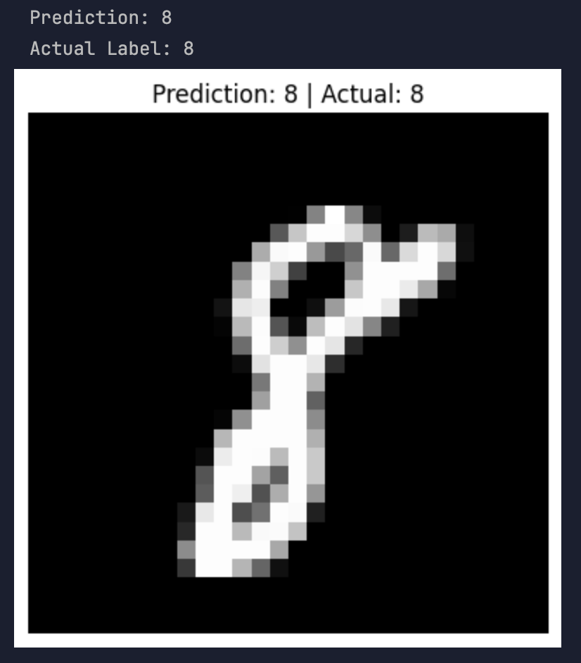
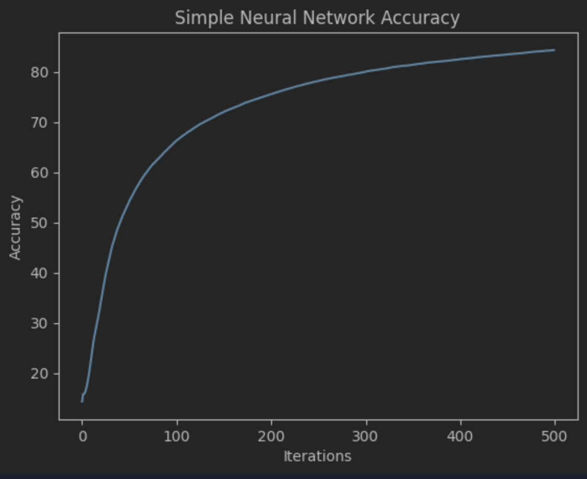

# Handwritten Digit Recogniser — Neural Network from Scratch

A handwritten digit classifier built from scratch using **Python and NumPy**, trained using the MNIST handwritten digit dataset from Kaggle's Digit Recognizer competition.

The purpose of this project was to understand how neural networks work internally by manually implementing **forward propagation, activation functions, backpropagation and gradient descent**, rather than using a machine-learning framework such as TensorFlow or PyTorch.

## Features

* Neural network implemented from scratch using NumPy
* Classifies handwritten digits from **0–9**
* ReLU activation function
* Softmax output layer
* One-hot encoding
* Forward propagation
* Backpropagation
* Gradient descent
* Training and development data split
* Pixel normalisation
* Training accuracy tracking
* Training accuracy visualisation
* Individual digit prediction visualisation
* Random prediction testing

## Dataset

This project uses the **MNIST handwritten digit dataset** provided through Kaggle's Digit Recognizer competition.

Each handwritten digit is represented as a:

```text
28 × 28 pixel image
```

The image is flattened into **784 individual pixel values** before being passed into the neural network.

Each training example therefore contains:

```text
label | pixel0 | pixel1 | pixel2 | ... | pixel783
```

The `label` represents the actual handwritten digit from **0–9**, while the remaining 784 values represent the intensity of each pixel.

The original pixel values range from:

```text
0–255
```

These are normalised to:

```text
0–1
```

before training.

The dataset itself is not included in this repository. It can be downloaded from the Kaggle **Digit Recognizer** competition.

## Data Preparation

The dataset is converted from a pandas DataFrame into a NumPy array and shuffled before training.

```python
data = np.array(data)

m, n = data.shape

np.random.shuffle(data)
```

The first 1,000 examples are reserved as a development set:

```python
data_dev = data[0:1000].T

Y_dev = data_dev[0].astype(int)

X_dev = data_dev[1:n]
X_dev = X_dev / 255.0
```

The remaining examples are used for training:

```python
data_train = data[1000:m].T

Y_train = data_train[0].astype(int)

X_train = data_train[1:n]
X_train = X_train / 255.0
```

This allows the trained network to later be evaluated using images that were not directly used during training.

## Neural Network Architecture

The neural network contains an input layer, one hidden layer and an output layer.

```text
28 × 28 Image
      ↓
784 Input Values
      ↓
10-Neuron Hidden Layer
      ↓
     ReLU
      ↓
10-Neuron Output Layer
      ↓
   Softmax
      ↓
Predicted Digit (0–9)
```

The input layer receives the **784 pixel values**.

The hidden layer contains **10 neurons** and uses the ReLU activation function.

The output layer contains **10 neurons**, corresponding to the ten possible digits:

```text
0 1 2 3 4 5 6 7 8 9
```

The output with the highest probability is selected as the network's prediction.

## Parameter Initialisation

The network begins by randomly initialising its weights and biases.

```python
def init_params():
    W1 = np.random.rand(10, 784) - 0.5
    b1 = np.random.rand(10, 1) - 0.5

    W2 = np.random.rand(10, 10) - 0.5
    b2 = np.random.rand(10, 1) - 0.5

    return W1, b1, W2, b2
```

`W1` connects the 784 input values to the 10 hidden neurons.

`W2` connects the 10 hidden neurons to the 10 output neurons.

## Forward Propagation

Forward propagation passes the input data through the neural network to generate a prediction.

### First Layer

The first layer calculates:

```text
Z₁ = W₁X + b₁
```

The result is passed through the ReLU activation function:

```text
A₁ = ReLU(Z₁)
```

### Output Layer

The second layer calculates:

```text
Z₂ = W₂A₁ + b₂
```

Softmax is then applied:

```text
A₂ = Softmax(Z₂)
```

`A₂` represents the network's output probabilities for each possible digit.

## ReLU Activation Function

The hidden layer uses the **Rectified Linear Unit (ReLU)** activation function.

```text
ReLU(Z) = max(0, Z)
```

This means:

* Negative values become `0`
* Positive values remain unchanged

The implementation is:

```python
def reLU(Z):
    return np.maximum(0, Z)
```

## Softmax

The output layer uses the **Softmax** activation function.

Softmax converts the output values into a probability distribution across the ten possible digits.

```text
Softmax(Zᵢ) = e^Zᵢ / Σe^Z
```

The implementation also subtracts the maximum value before calculating the exponential to improve numerical stability:

```python
def softmax(Z):
    Z = Z - np.max(Z, axis=0, keepdims=True)

    exp_Z = np.exp(Z)

    return exp_Z / np.sum(
        exp_Z,
        axis=0,
        keepdims=True
    )
```

## One-Hot Encoding

The digit labels are converted into one-hot encoded vectors before backpropagation.

For example, the digit:

```text
3
```

can be represented as:

```text
[0, 0, 0, 1, 0, 0, 0, 0, 0, 0]
```

This allows the network's output probabilities to be compared against the correct class.

## Backpropagation

Backpropagation determines how much each weight and bias contributed to the prediction error.

The output-layer error is calculated using:

```text
dZ₂ = A₂ - Y
```

The gradient for the second set of weights is:

```text
dW₂ = (1/m)dZ₂A₁ᵀ
```

The error is then propagated backwards through the hidden layer:

```text
dZ₁ = W₂ᵀdZ₂ × ReLU'(Z₁)
```

The gradient for the first set of weights is:

```text
dW₁ = (1/m)dZ₁Xᵀ
```

These gradients indicate how the network's parameters should change to improve its predictions.

## Gradient Descent

The weights and biases are updated using **gradient descent**.

The general update rule is:

```text
W = W - αdW

b = b - αdb
```

where `α` represents the learning rate.

For example, the network can be trained using:

```python
W1, b1, W2, b2, accuracy_history = gradient_descent(
    X_train,
    Y_train,
    0.1,
    500
)
```

This uses:

```text
Learning Rate: 0.1
Iterations:    500
```

During each iteration the network:

1. Performs forward propagation
2. Calculates the prediction error
3. Performs backpropagation
4. Calculates the gradients
5. Updates its weights and biases
6. Calculates the current training accuracy

## Making Predictions



After training, predictions are made by performing another forward pass through the network.

```python
def make_predictions(X, W1, b1, W2, b2):
    _, _, _, A2 = forward_prop(
        W1,
        b1,
        W2,
        b2,
        X
    )

    predictions = get_predictions(A2)

    return predictions
```

The predicted digit is the output neuron with the highest probability:

```python
def get_predictions(A2):
    return np.argmax(A2, axis=0)
```

## Model Evaluation

Accuracy is calculated by comparing the network's predictions with the actual labels:

```python
def get_accuracy(predictions, Y):
    return np.mean(predictions == Y) * 100
```


### Results

| Metric               |                  Accuracy |
| -------------------- | ------------------------: |
| Training Accuracy    | 86% |




Results may vary slightly between runs because the dataset is shuffled and the weights and biases are randomly initialised.

## Training Accuracy Visualisation

Training accuracy is recorded throughout gradient descent.

This allows the learning process to be visualised using Matplotlib:

```python
plt.plot(accuracy_history)

plt.xlabel("Iteration")
plt.ylabel("Training Accuracy (%)")
plt.title("Neural Network Training Accuracy")

plt.show()
```

This graph demonstrates how the network's classification accuracy changes as its parameters are updated.

## Prediction Visualisation

The project can display an individual handwritten digit alongside the model's prediction.

```python
def show_prediction(index, X, Y, W1, b1, W2, b2):

    current_image = X[:, index, None]

    prediction = make_predictions(
        current_image,
        W1,
        b1,
        W2,
        b2
    )

    label = Y[index]

    print("Prediction:", prediction[0])
    print("Actual Label:", label)

    image = X[:, index].reshape(28, 28)

    plt.imshow(image, cmap="gray")

    plt.title(
        f"Prediction: {prediction[0]} | Actual: {label}"
    )

    plt.axis("off")
    plt.show()
```

The original 784-element input vector is reshaped back into a **28 × 28 image** so that it can be displayed.

Random development images can also be selected to test the trained network:

```python
def show_random_prediction(X, Y, W1, b1, W2, b2):

    index = np.random.randint(
        0,
        X.shape[1]
    )

    show_prediction(
        index,
        X,
        Y,
        W1,
        b1,
        W2,
        b2
    )
```

This makes it possible to inspect both correct predictions and examples where the model makes mistakes.

## Technologies Used

* Python
* NumPy
* pandas
* Matplotlib
* Jupyter Notebook
* PyCharm
* Git
* GitHub

## Project Structure

```text
DigitRecogniser/
│
├── README.md
├── digit_recogniser.ipynb
├── .gitignore
│
└── data/
    └── train.csv    # Not committed to GitHub
```

The dataset is excluded from GitHub using `.gitignore`.

## Running the Project

### 1. Clone the repository

Clone the project from GitHub.

### 2. Install the dependencies

```bash
pip install numpy pandas matplotlib jupyter
```

### 3. Download the dataset

Download the **Digit Recognizer** dataset from Kaggle.

Place `train.csv` inside:

```text
data/train.csv
```

The dataset itself is not included in this repository.

### 4. Run the notebook

Open:

```text
digit_recogniser.ipynb
```

Run the notebook cells in order to preprocess the data, train the neural network and evaluate its predictions.

## What I Learned

This project helped me develop a stronger understanding of the fundamental concepts behind neural networks, including:

* Working with NumPy arrays and matrices
* Data preprocessing and normalisation
* Neural network architecture
* Forward propagation
* ReLU activation
* Softmax classification
* One-hot encoding
* Backpropagation
* Gradient descent
* Weight and bias optimisation
* Training datasets
* Model evaluation
* Image classification
* Data visualisation

Implementing these components manually helped me understand what happens internally when a neural network learns, rather than relying entirely on high-level machine-learning frameworks.

## Future Improvements

Potential improvements to the project include:

* Increasing the number of neurons in the hidden layer
* Experimenting with different learning rates
* Tracking loss alongside accuracy
* Adding a confusion matrix
* Analysing incorrectly classified digits
* Testing alternative activation functions
* Adding additional hidden layers
* Comparing the NumPy implementation with TensorFlow or PyTorch
* Evaluating the model using the Kaggle test dataset

## Acknowledgements

### Resources

- [Building a Neural Network from Scratch – Samson Zhang](https://youtu.be/w8yWXqWQYmU)
- The dataset used for this project comes from Kaggle's **Digit Recogniser** competition and is based on the MNIST handwritten digit dataset.
